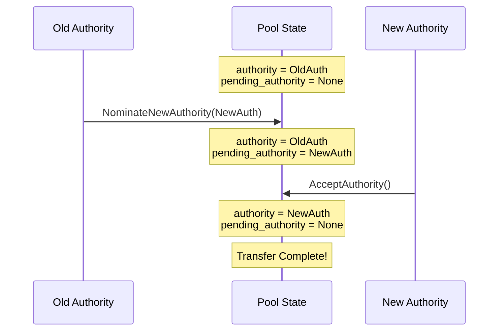
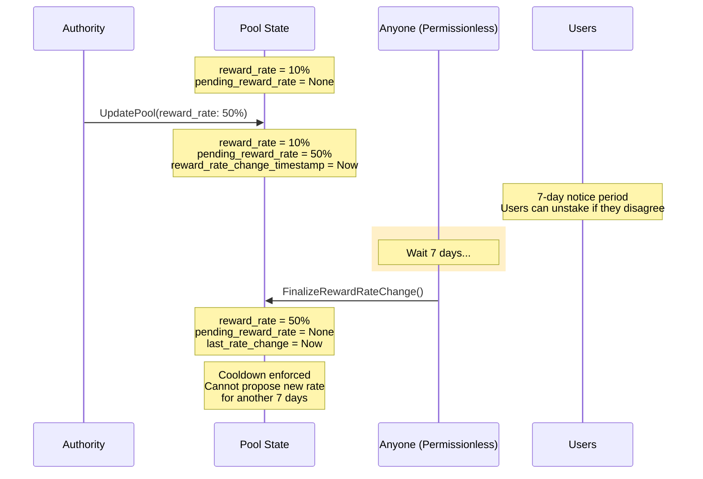
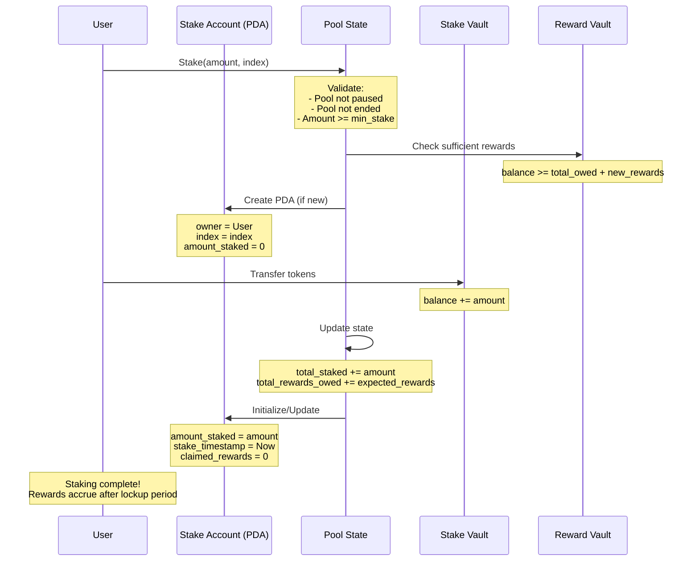
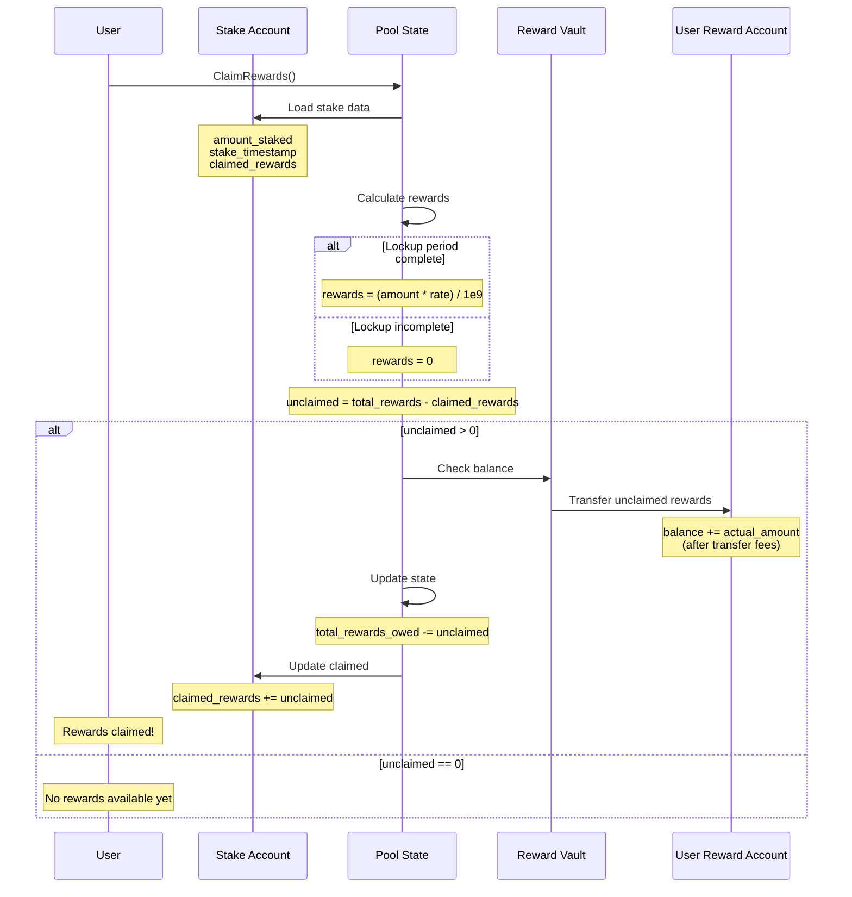
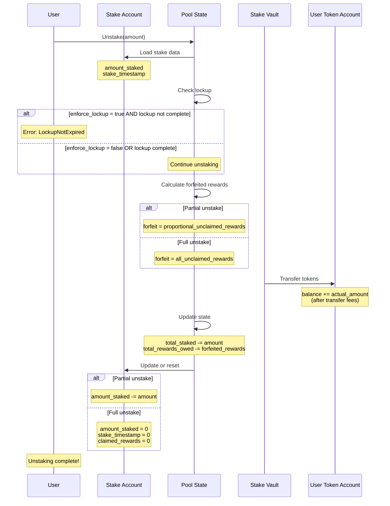

# Your Wallet Stake Pool

<a href="https://github.com/yourwalletio/stake-pool/actions/workflows/main.yml"></a>
<a href="https://github.com/yourwalletio/stake-pool/actions/workflows/main.yml"></a>
<a href="https://explorer.solana.com/address/8PtjrGvKNeZt2vCmRkSPGjss7TAFhvxux2N8r67UMKBx"></a>
<a href="https://www.npmjs.com/package/@yourwallet/stake-pool"></a>

A secure, flexible staking program for Solana that enables token holders to stake their SPL tokens and earn fixed rewards. Built with security-first principles and full support for Token-2022 extensions including transfer fees.

## Overview

YW Stake Pool is a production-ready Solana program that provides:

- **🔒 Secure Staking** - Stake any SPL token or Token-2022 with transfer fee support
- **💰 Fixed Rewards** - Predictable rewards based on configurable reward rates
- **⏱️ Flexible Lockup** - Customizable lockup periods per pool
- **🛡️ Security Features** - Built-in protections against common vulnerabilities:
  - Type Cosplay Protection (account discriminators)
  - Frontrunning Protection (parameter verification)
  - Account Validation (ownership checks)
  - Two-step Authority Transfer
- **🔧 Pool Management** - Full administrative controls for pool operators
- **📊 Multi-Pool Support** - Create unlimited pools with different parameters

## Features

### For Stakers
- **Stake** any supported SPL token
- **Earn** fixed rewards after lockup period
- **Claim** rewards at any time
- **Unstake** partially or fully (with early exit option)
- **Track** multiple stakes with indexed stake accounts

### For Pool Operators
- **Initialize** pools with custom parameters (reward rate, lockup, minimum stake)
- **Create Multiple Pools** - Same authority can manage multiple pools for the same token using unique pool IDs
- **Update** pool settings (pause/unpause, change rates)
- **Fund** reward vaults to ensure liquidity
- **Transfer** authority with two-step verification
- **Set** optional pool end dates

## Security

This program implements multiple security best practices:

1. **Type Cosplay Protection** - Account discriminators prevent type confusion attacks
2. **Frontrunning Protection** - Transactions can verify expected pool parameters
3. **Account Validation** - Comprehensive ownership and state validation
4. **Transfer Fee Support** - Properly handles Token-2022 transfer fees
5. **Numerical Overflow Protection** - All arithmetic uses checked operations
6. **Two-step Authority Transfer** - Prevents accidental authority loss
7. **Admin-Only Pool Creation** - Only authorized addresses can create pools (prevents spam/scam pools)

See [SECURITY_AUDIT.md](./SECURITY_AUDIT.md) for detailed security analysis.

## Architecture

```
Program Structure:
├── State Management (237 bytes pool account, 98 bytes stake account)
├── 9 Instructions (Initialize, Stake, Unstake, Claim, Update, Fund, Authority)
├── Token-2022 Support (Transfer fees, extensions)
└── Comprehensive Error Handling (15 custom error types)
```

**Program ID**: `8PtjrGvKNeZt2vCmRkSPGjss7TAFhvxux2N8r67UMKBx`

### Operational Workflows

The following diagrams illustrate key multi-step operations in the stake pool:

#### Authority Transfer Flow



#### Reward Rate Change Flow (Time-Locked)



#### Staking Workflow



#### Claiming Rewards Workflow



#### Unstaking Workflow



## Quick Start

### Installation

```sh
# Clone the repository
git clone https://github.com/yourwalletio/yw-stake-pool.git
cd yw-stake-pool

# Install dependencies
pnpm install
```

### Running Examples

The `example` directory contains comprehensive examples demonstrating all stake pool functionality:

```sh
# Build the example code
cd example
pnpm install
pnpm build

# Run examples:
pnpm simple           # Basic instruction creation (no network calls)
pnpm pool-admin       # Pool management demos
pnpm user-staking     # User staking workflow demos
pnpm devnet-test      # Live integration test on Solana devnet
```

See [example/README.md](./example/README.md) for detailed documentation.

### Development

Build and test the program locally:

```sh
pnpm programs:build
pnpm programs:test
```

### Using the Client Library

Install the JavaScript/TypeScript client:

```sh
npm install @yourwallet/stake-pool
# or
pnpm add @yourwallet/stake-pool
```

Basic usage:

```typescript
import { 
  getInitializePoolInstruction,
  getStakeInstruction,
  getClaimRewardsInstruction,
} from '@yourwallet/stake-pool';

// Initialize a pool
const initIx = getInitializePoolInstruction({
  pool: poolAddress,
  authority: authority,
  stakeMint,
  rewardMint,
  stakeVault,
  rewardVault,
  payer: authority,
  tokenProgram: TOKEN_PROGRAM_ID,
  systemProgram: SYSTEM_PROGRAM_ID,
  rent: SYSVAR_RENT_PUBKEY,
  poolId: 0n,                    // Unique ID (0 for first pool, 1 for second, etc.)
  rewardRate: 100_000_000n,      // 10% APY
  minStakeAmount: 1_000_000n,    // 1 token (6 decimals)
  lockupPeriod: 86400n,          // 1 day
  poolEndDate: null,
});

// Stake tokens
const stakeIx = getStakeInstruction({
  pool: poolAddress,
  stakeAccount: stakeAccountAddress,
  owner: user,
  userTokenAccount,
  stakeVault,
  rewardVault,
  stakeMint,
  tokenProgram: TOKEN_PROGRAM_ID,
  payer: user,
  systemProgram: SYSTEM_PROGRAM_ID,
  amount: 100_000_000n,  // 100 tokens
  index: 0n,
});
```

See [clients/js/README.md](./clients/js/README.md) for full API documentation.

### Multiple Pools Per Token

A single authority can create multiple stake pools for the same token by using different `poolId` values. This allows pool operators to:

- Run multiple pools with different reward rates and lockup periods
- Segment user groups (e.g., VIP vs standard pools)
- Test new configurations without affecting existing pools
- Create time-limited promotional pools

Each pool is identified by the combination of `(authority, stakeMint, poolId)`, so use:
- `poolId: 0n` for your first pool
- `poolId: 1n` for your second pool
- And so on...

**Built-in Safeguards:**
The program validates that the pool address matches the provided `pool_id`. If you:
- ❌ Use the wrong `pool_id` when deriving the PDA → Transaction fails (address mismatch)
- ❌ Try to reuse an existing `pool_id` → Transaction fails (account not empty)
- ✅ Always use `findPoolPda()` helper → Correct address is guaranteed

**⚠️ IMPORTANT: Pool ID After Authority Transfer**

After transferring pool authority (via `NominateNewAuthority` + `AcceptAuthority`), be aware of pool ID management:

1. **Old authority can still create new pools**: The previous authority can create new pools for the same token with any pool_id, since pool PDAs are derived from `(authority, stakeMint, poolId)`

2. **No automatic collision prevention**: The program doesn't track which authority created which pool_id

3. **Best practices after authority transfer**:
   - **Document pool ownership**: Maintain off-chain records of which pool_ids belong to which authority
   - **Use different pool_id ranges**: Old authority uses 0-999, new authority uses 1000+
   - **Increment from highest**: Always query existing pools and use `max(pool_id) + 1`
   - **Avoid reusing pool_ids**: Even though PDAs differ, user confusion may occur

**Example Scenario**:
```typescript
// Before transfer: Alice owns Pool ID 0 for USDC
// Alice transfers authority to Bob
// Bob now controls the existing Pool ID 0

// Later, Alice creates a NEW Pool ID 0 for USDC
// This creates a DIFFERENT pool (different PDA)
// but same (old_authority, USDC, 0) identifier

// Result: Two pools with confusingly similar identifiers
// - Alice's new pool: PDA(Alice, USDC, 0)
// - Bob's transferred pool: PDA(Alice, USDC, 0) ← Same authority in PDA!
```

The pools are technically separate (Bob controls one, Alice controls the other), but the shared identifier scheme can cause confusion. Use the best practices above to avoid this.

## Documentation

- **[Example Code](./example/README.md)** - Comprehensive examples with live devnet test
- **[Client Library](./clients/js/README.md)** - JavaScript/TypeScript API documentation
- **[Security Audit](./SECURITY_AUDIT.md)** - Detailed security analysis
- **[Program Documentation](#architecture)** - Architecture and design decisions

## Development

### Project Setup

Install dependencies:

```sh
pnpm install
```

### Managing programs

You'll notice a `program` folder in the root of this repository. This is where your generated Solana program is located.

Whilst only one program gets generated, note that you can have as many programs as you like in this repository.
Whenever you add a new program folder to this repository, remember to add it to the `members` array of your root `Cargo.toml` file.
That way, your programs will be recognized by the following scripts that allow you to build, test, format and lint your programs respectively.

```sh
pnpm programs:build
pnpm programs:test
pnpm programs:format
pnpm programs:lint
```

### Deploying programs

Deploy your program to a Solana cluster:

```sh
# Deploy to devnet (default)
pnpm programs:deploy

# Deploy to specific cluster
pnpm programs:deploy -- --cluster mainnet-beta

# Deploy with custom upgrade authority
pnpm programs:deploy -- --keypair /path/to/authority.json
```

The deploy script automatically detects the program ID from your repository keypairs.

### Managing authority

The project includes tools for managing program upgrade authority:

#### Program Upgrade Authority

Transfer or revoke program upgrade authority using Solana CLI:

```sh
# Transfer upgrade authority to a new address
pnpm programs:transfer-authority -- --new-authority <ADDRESS>

# Make program immutable (irreversible!)
pnpm programs:transfer-authority -- --none

# View help and options
pnpm programs:transfer-authority -- --help
```

This is a **one-step, immediate transfer** using Solana's native authority management. Use with caution!

**Note:** Pool operational authority (for managing pool parameters, funding rewards, etc.) can be transferred using the program's built-in two-step authority transfer instructions (`NominateNewAuthority` and `AcceptAuthority`). See the [Client Library documentation](./clients/js/README.md) for details on using these instructions.

## Generating IDLs

You may use the following command to generate the IDLs for your programs.

```sh
pnpm generate:idls
```

Depending on your program's framework, this will either use Shank or Anchor to generate the IDLs.
Note that, to ensure IDLs are generated using the correct framework version, the specific version used by the program will be downloaded and used locally.

## Generating clients

Once your programs' IDLs have been generated, you can generate clients for them using the following command.

```sh
pnpm generate:clients
```

Alternatively, you can use the `generate` script to generate both the IDLs and the clients at once.

```sh
pnpm generate
```

## Managing clients

The following clients are available for your programs. You may use the following links to learn more about each client.

- [JS client](./clients/js)

## Starting and stopping the local validator

The following script is available to start your local validator.

```sh
pnpm validator:start
```

By default, if a local validator is already running, the script will be skipped. You may use the `validator:restart` script instead to force the validator to restart.

```sh
pnpm validator:restart
```

Finally, you may stop the local validator using the following command.

```sh
pnpm validator:stop
```

## Using external programs in your validator

If your program requires any external programs to be running, you'll want to in your local validator.

You can do this by adding their program addresses to the `program-dependencies` array in the `Cargo.toml` of your program.

```toml
program-dependencies = [
  "metaqbxxUerdq28cj1RbAWkYQm3ybzjb6a8bt518x1s",
  "noopb9bkMVfRPU8AsbpTUg8AQkHtKwMYZiFUjNRtMmV",
]
```

Next time you build your program and run your validator, these external programs will automatically be fetched from mainnet and used in your local validator.

```sh
pnpm programs:build
pnpm validator:restart
```

## Contributing

Contributions are welcome! Please feel free to submit a Pull Request.

## License

Apache License 2.0 - See [LICENSE](./LICENSE) for details.
