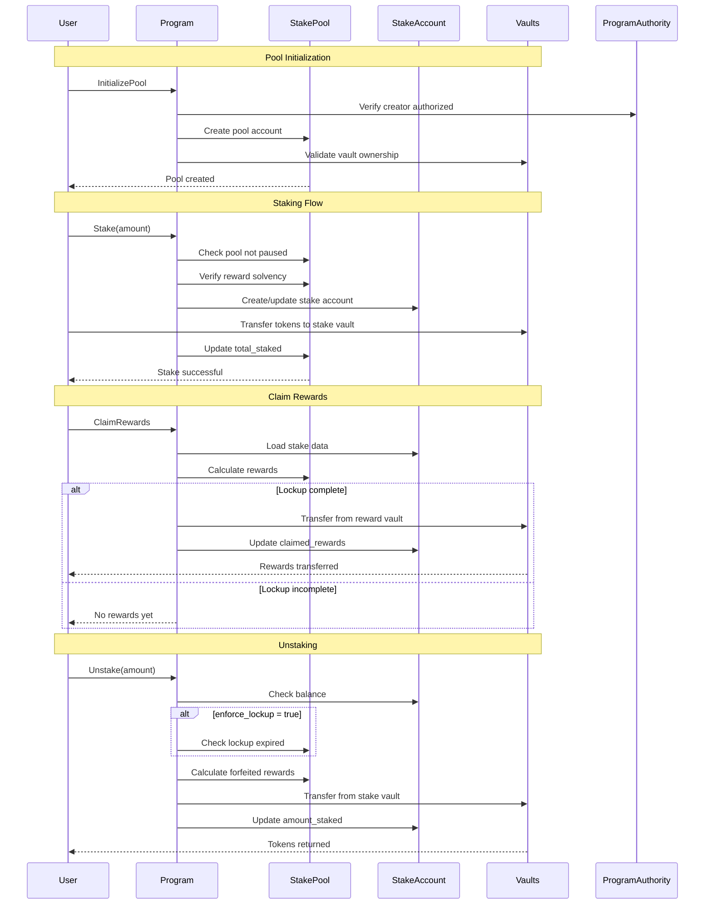
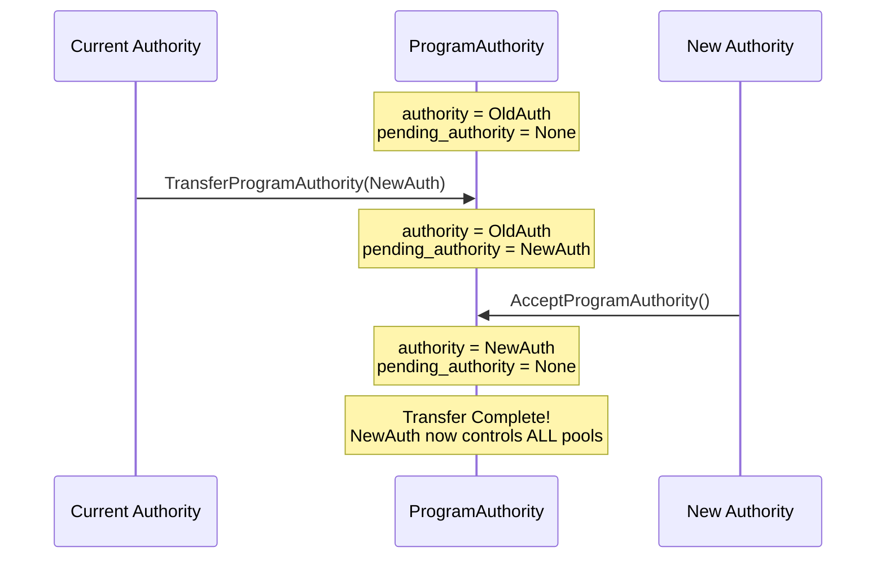

# YW Stake Pool - Architecture

## Overview

The YW Stake Pool is a Solana program that enables secure token staking with fixed reward rates and flexible lockup periods. This document provides a high-level architectural overview of the system.

## Core Components

### State Accounts


- **ProgramAuthority**: Global authority that controls who can create new pools (398 bytes)
  - Single authority address
  - List of up to 10 authorized creator addresses
  - Pending authority for two-step transfer
- **StakePool**: Individual pool configuration (reward rate, lockup period, vaults) - 223 bytes
  - No per-pool authority (managed globally via ProgramAuthority)
- **StakeAccount**: User's stake position (amount, timestamp, claimed rewards)
- **Stake Vault**: Token account holding all staked tokens for a pool
- **Reward Vault**: Token account holding reward tokens for distribution

### Key Operations Flow



## Detailed Operational Workflows

### Authority Transfer Flow

Two-step process prevents accidental authority loss. This transfers **global program authority** (control over entire system):



**Important**: This is a **global operation** that transfers control of the entire program, not individual pools. The new authority will control:
- Who can create new pools (via ManageAuthorizedCreators)
- Global program settings
- All future administrative operations

### Reward Rate Change Flow (Time-Locked)

Seven-day delay gives users time to exit if they disagree:


### Staking Workflow

Complete flow from user action to state updates:


### Claiming Rewards Workflow

Rewards are only available after lockup period completes:


### Unstaking Workflow

Partial or full unstake with optional lockup enforcement:


## Account Relationships

```mermaid
graph LR
    subgraph "PDA Derivation"
        SP_SEEDS["['stake_pool', stake_mint, pool_id]"]
        SA_SEEDS["['stake_account', pool, owner, index]"]
        PA_SEEDS["['program_authority']"]
    end
    
    SP_SEEDS -->|derives| SP[StakePool PDA]
    SA_SEEDS -->|derives| SA[StakeAccount PDA]
    PA_SEEDS -->|derives| PA[ProgramAuthority PDA]
    
    PA -->|authority: Pubkey| MAIN_AUTH[Main Authority]
    PA -->|authorized_creators: [Pubkey; 10]| CREATORS[Authorized Creators]
    PA -->|controls creation| SP
    
    SP -->|stake_vault: Pubkey| SV[Stake Vault Token Account]
    SP -->|reward_vault: Pubkey| RV[Reward Vault Token Account]
    
    SA -->|pool: Pubkey| SP
    SA -->|owner: Pubkey| USER[User Wallet]
    
    style SP fill:#fff4e1
    style SA fill:#ffe1f5
    style PA fill:#e1f5ff
```

**Key Changes from Per-Pool Authority:**
- StakePool no longer has `authority` or `pending_authority` fields
- All administrative control flows through global ProgramAuthority
- UpdatePool instruction requires both `admin` signer AND `programAuthority` validation

## Security Model

### Type Safety
- All accounts use discriminators (Type Cosplay protection)
- Account ownership validated before deserialization
- PDA validation ensures correct derivation

### Authorization
- Signer checks on all sensitive operations
- Two-step program authority transfer (TransferProgramAuthority + AcceptProgramAuthority)
- Global admin model: ProgramAuthority controls pool creation and updates
- Authorized creators list allows delegation (up to 10 addresses)
- Admin verification required for UpdatePool operations

### Economic Security
- Pre-flight reward solvency checks
- Checked arithmetic (no overflow/underflow)
- Transfer fee support for Token-2022
- Freeze authority validation

### Time-Locked Operations


## Data Flow

### Reward Calculation
```
Expected Rewards = (amount_staked × reward_rate) ÷ REWARD_SCALE
Where REWARD_SCALE = 1_000_000_000 (1e9)

Example:
- Stake: 1000 tokens
- Rate: 100_000_000 (10% when divided by 1e9)
- Rewards: (1000 × 100_000_000) ÷ 1_000_000_000 = 100 tokens
```

### Pool Solvency Tracking
```
total_staked: Sum of all user stakes
total_rewards_owed: Sum of all expected rewards
reward_vault.balance: Actual tokens available

Invariant: reward_vault.balance ≥ total_rewards_owed
```

## Extension Points

### Multiple Pools
Pools are identified by `(stake_mint, pool_id)` allowing:
- Multiple reward rates for the same token
- Different lockup periods
- Separate user segments (VIP vs standard)

**Authorization**: Only addresses authorized by ProgramAuthority can create pools:
- Main authority (always authorized)
- Up to 10 additional addresses in authorized_creators list
- Managed via ManageAuthorizedCreators instruction

### Token-2022 Support
- Transfer fee handling via balance checking
- Extension validation (blocks dangerous extensions)
- Forward-compatible with new token standards

## Error Handling

The program uses custom error types for clear failure modes:
- `PoolPaused`: Operations blocked when pool is paused
- `InsufficientRewards`: Not enough rewards in vault
- `LockupNotExpired`: Early withdrawal when enforce_lockup=true
- `PoolParametersChanged`: Frontrunning protection triggered

## Performance Considerations

- **Account Size**: ProgramAuthority = 398 bytes, StakePool = 223 bytes, StakeAccount = 98 bytes
- **Compute Units**: Typical operations < 200k CU
- **Rent-Exempt Minimum**: 
  - ProgramAuthority: ~3.2M lamports (created once per program deployment)
  - StakePool: ~2.2M lamports
  - StakeAccount: ~1.2M lamports
- **Concurrent Operations**: Lock-free design allows parallel stakes

## Upgrade Path

The program uses reserved fields for future upgrades:
```rust
pub struct StakePool {
    // ... existing fields
    pub reserved: [u8; 7],  // For future use
}

pub struct ProgramAuthority {
    // ... existing fields  
    pub reserved: [u8; 32],  // For future use
}
```

**Breaking Changes**: Require full migration (drain → close → redeploy)

**Global Admin Model**: The ProgramAuthority account persists across program upgrades, maintaining administrative control and authorized creator lists.

## Monitoring & Observability

Events emitted for off-chain indexing:
- `InitializePool`: New pool created
- `Stake`: User stakes tokens
- `Unstake`: User withdraws tokens
- `ClaimRewards`: User claims rewards
- `FundRewards`: Pool funded with rewards

These events enable real-time notifications and analytics via Helius, TheGraph, or custom indexers.
